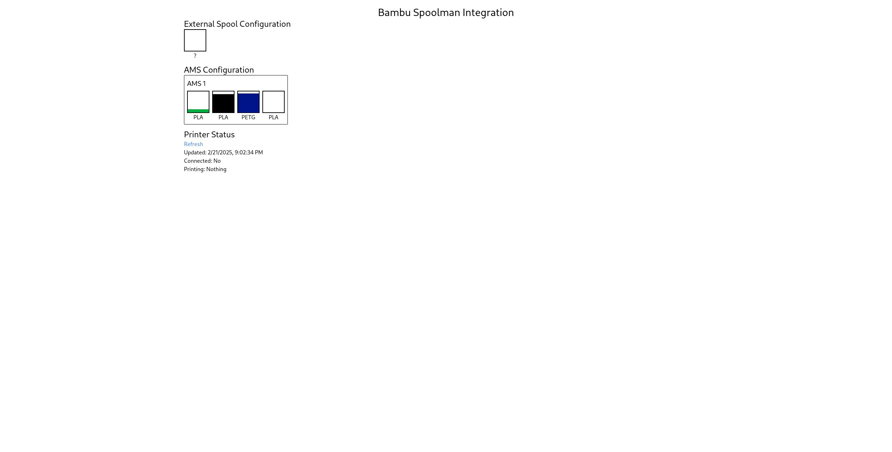
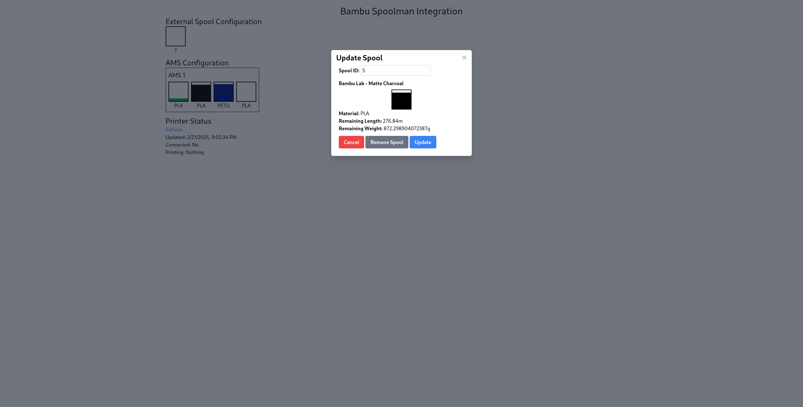

Back in November, I bought a BambuLab P1S 3D printer. After printing a few things, it became clear that one question didn't have an easy answer: "How much filament is there left on this roll?" Obviously, I could just weigh it, but that's imprecise.

While perusing the various 3D Printing subreddits, I came across [Spoolman](https://github.com/Donkie/Spoolman) -- a self-hosted service that manages your growing inventory filament rolls. The key feature that drew me to Spoolman was its ability to track how much filament was left on a roll.

## Integration

Spoolman provides a generic REST API that allows external programs to interface with all aspects of Spoolman. Notably, however, there was no good integrations for BambuLab printers. There were a few attempts to integrate spoolman with Bambu printers, but these would just consume all of the filament immediately when the print started. For most use-cases, this would be just fine but it doesn't cover one of the biggest edge cases -- What if a print failed? The spool weight in Spoolman would diverge from the actual spool weight and would require getting out the kitchen scale to reconcile the roll.

Since there was wasn't an integration that fit my needs, I decided to write my own. Bambulab printers expose a local [MQTT broker](https://github.com/Doridian/OpenBambuAPI/blob/main/mqtt.md) that allows 3rd party software to connect to the printer and control it. I wrote a simple program to connect to this broker and print out whatever messages were sent.

After starting a test print, the following message was emitted after every layer, with `layer_num` being the new layer number:

```json
{"nozzle_temper": 219.6875, "wifi_signal": "-45dBm", "layer_num": 10, "command": "push_status", "msg": 1, "sequence_id": "319"}
```

Since I could now detect when a layer changed, I could now determine how long a print was and only consume a portion of the filamnent after each layer. However, the answer to this question led to another question (as many engineering problems do): How much filament does each layer use?

## GCode

The answer to this question could be determined relatively easily. 3D printers read GCode -- a long list of text-based instructions that precisely tell the printer how it should behave. This is what a slicer (Such as Bambu Studio) does. It translates your mesh file (usually in the form of an stl) into a list of thousands of gcode instructions. This code is then uploaded to the printer, executed, and your model printed out.

Even though BambuLab printers are propreitary, their slicer allows for editing gcode for various parts of the print (such as layer change, time lapse, etc.). In particular, the default layer change gcode for my P1s is

```txt
; layer num/total_layer_count: {layer_num+1}/[total_layer_count]
; update layer progress
M73 L{layer_num+1}
M991 S0 P{layer_num} ;notify layer change
```

Cross-referencing with the [Marlin](https://marlinfw.org/docs/gcode/M073.html) gcode reference, `M73` is the command for "Set Print Progress." While `L` does not appear to be a documented parameter, it appears that Bambu printers use that to indicate what layer the printer is on. There is also the undocumented `M991` command, but I opted to use `M73`, as this is explicitly defined for setting a print's progress.

However, this was only the half the battle. While I could detect when a layer changed, I didn't know yet how much fialment was extruded during each layer. In order to find this, I needed to dig deeper. Once again, cross-referencing the Marlin gcode reference with the gcode of a model that I sliced in BambuStudio, there are 4 primary gcode commands that extrude filament: `G0`, `G1`, `G2`, and `G3`. The former two (`G0` and `G1`) encode a linear movement (a straight line), while the latter (`G2` and `G3`) encode an arc. The parameter `E` to this instruction specifies how much filament (in mm) is extruded during the operation. By summing up the extrusion amount for all of these operations on a particular layer, I now knew how much filament was extruded on each layer. Notably, knowing how far the printhead moves isn't important, I only need to know how much filament is extruded (or retracted) for each movement instruction.

### The AMS

There was one final hurdle to clear: the AMS system. BambuLab printers support the AMS system that allows for automatic color changes mid-print. This can happen at any pont when printing a layer, so there's no guarantee that a layer consists of a single color. 

Once again, the slicer's settings came to the rescue. Looking at the Change filament gcode, the very first line is:

```txt
M620 S[next_extruder]A
```

which looks like it instructs the printer to start an automatic toolchange. Slicing a model with multiple colors confirmed that `M620` indicates a tool change.

By tracking which filament is active, I had the final piece of the puzzle. I now knew how much filament was extruded for each layer as well as what filament(s) were used.

## Putting it All Together

Armed with the various pieces of information about a particular print my printer was printing, it was time to put everything together! I wrote a Python program that would connect to the printer's MQTT broker and listen for the command that initiated a print. Once the print was initiated, I would then download the model that was being printed, extract the gcode and finally parse the [gcode](#gcode). It would then wait for the printer to signal that a layer changed, and spend the filament of the new layer in Spoolman.

While a print can still fail mid-layer, the drift has been narrowed down to just a few mm of filament! Much better than "the entire print" that I was working with initially.

### The Web UI

One final requirement I had was that I wanted it to be easy to configure which spools are being tracked. Some integrations would attempt to guess what spoolman spool was in a particular AMS slot by reading the RFID tag that Bambu filament has, but this is a proprietary format, and only works for bambu filament. If there was 3rd party filament in one of the AMS slots, it wouldn't be able to detect that.

The easiest solution is to have the end-user (me) manually tell the program which spools are in which AMS slot. However, this needed to be quick and easy to do. I didn't want to have to ssh into a server to manually configure the mappings. Instead, I built a fairly basic Web UI (Seen Below).



This web UI would show basic statistics about the the connected printer, as well as list what spools are loaded into the AMS. By clicking/tapping on one of the slots, a dialog opens up that shows a little bit of information about a particular spool as well as allows them to change it.



When opened on a phone (or any device with a camera), there is an additional "Scan QR Code" button that will interpret the Spoolman generated QR codes and auto fill the spool id.

## The Results

I've been using this program for most of the lifetime of my printer (Currently almost 6 months) and it's been pretty reliable. There were a few kinks that I needed to work out early on, but for the most part, it's been pretty reliable. I've added a few additional features since the original iteration such as:

- Automatic filament detection -- The program can read the RFID tags for the rolls and look up a corresponding roll in Spoolman. If a match is found, it will automatically switch to that roll.
- PWA support -- Adds a web manifest so I can add the app to the home screen on my phone and get a native-like experience
- Checkpoints -- A checkpoint is saved with the currently printing model to allow for resuming tracking after being rebooted.

This project is open source! If you're interested in checking this out for yourself, you can view the repository [here](https://github.com/mrkirby153/bambu-spoolman/)!
