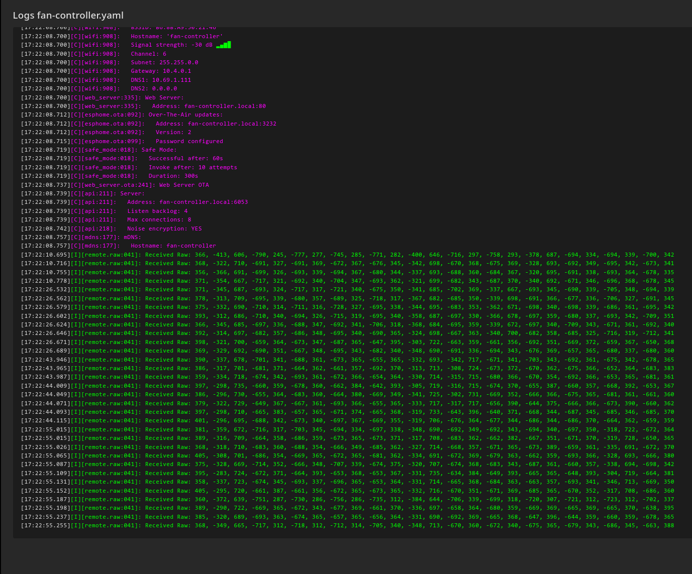
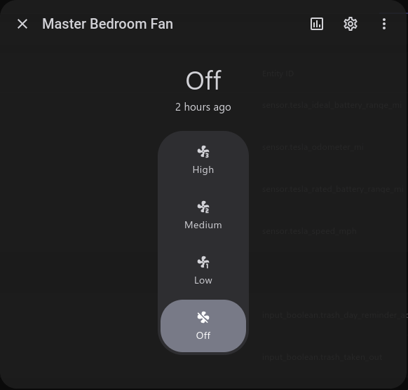

**Note:** The links in this article are NOT affiliate links. I'm not popular enough for them.

A while ago, I bought [this](https://www.homedepot.com/p/324339720) fan (or something similar) for one of the bedrooms in my house. It's a pretty bog-standard fan and light combo, but comes with one big caveat: it's primarily controlled by a remote. It's even dimmable! No more reaching up and yanking on a chain to adjust the fan speed. However, this posed a challenge: smart switches. With an independent remote, how would I integrate this into my smart home?

## Smart Switches

Late 2023 was my intro into the whole smart home ecosystem. I picked up a handful of [Inovelli Red](https://inovelli.com/collections/z-wave-light-switches-red-series/products/z-wave-800-red-series-smart-2-1-on-off-dimmer-switch) smart switches so I could automate turning on and off my lights (Maybe a post for another time). After getting these installed and set up, they worked reliably for several years, and I have a decently strong z-wave mesh throughout my house.

Fast forward to 2025, and I wanted to make the ceiling fans in my house smart. Inovelli offers two solutions for this: their [Blue Zigbee](https://inovelli.com/collections/inovelli-blue-series) series, and [White Matter-over-thread](https://inovelli.com/collections/inovelli-white-series) series switches. Notably, they do not offer a Red Z-Wave fan switch. As such I had a choce: Zigbee or Matter.

Ultimately, I went with their Blue switches. Combined with a [SMLIGHT SLZB-06](https://smlight.tech/product/slzb-06/), I started to build out a zigbee mesh. Even though Matter is the new hotness, I personally think that zigbee and z-wave will exist for a long time and there's not a whole lot of devices that currently support Matter. Even though IKEA has [announced](https://www.ikea.com/global/en/newsroom/retail/the-new-smart-home-from-ikea-matter-compatible-251106/) recently that they're all-in on Matter and discontinuing their Zigbee line of devices.

These Inovelli fan switches are pretty cool. They allow you to set presets for "Low," "Medium," and "High" settings, which adjust the output voltage sent to the fan. For most AC fans, that's all you need. However, for my fan, you adjust the speed by using the remote! Thankfully these switches also have an "Exhaust Fan" mode, which is basically just on/off with no variable speed. Even though this isn't a traditional exhaust fan, this'll work.

However, there's a new challenge: How can I still get variable speed controls in HomeAssistant?

## An ESP32

Enter the humble ESP32. If you've been living under a rock, an ESP32 is a cheap microcontroller with wifi capabilities. They're very similar to an arduino, but targeted more towards IOT and smart home applications and less towards the hobbiest tinkerer.

ESP32's (or their clones) are also extremely cheap and I bought [3 ESP32-S3's](https://www.amazon.com/dp/B0DG8L7MQ9) for $17 (A per-unit cost of $5.66). While there are some specialized ESP32 boards (e.g. WLED controllers or other integrated products), most ESP32's come on development boards. These boards usually provide access to all of the microcontroller's GPIO pins on easy to access headers.

However, an ESP32 is only half the battle. The goal of this project was to emulate the supplied remote. Poking around on Google, I came across the [TI CC1101](https://www.ti.com/product/CC1101). This is a general purpose sub 1 GHz wireless transcever that people have had success controlling various wireless devices like fireplaces, blinds, or ceiling fans. These are also put on [development boards](https://www.amazon.com/dp/B0D2TMTV5Z) for prototyping.

### Hello World

Ok, so parts ordered and 2 days later (Thank you Amazon Prime), I had all the pieces. It was time to start putting everything together. However, I wouldn't be writing any firmware for this in the traditional sense. [ESPHome](https://esphome.io/) is a powerful project that can turn ESP32's and other cheap microcontrollers into smart home devices with just yaml. There's even a [HomeAssistant](https://esphome.io/guides/getting_started_hassio/) integration.

After getting ESPHome set up and flashed onto the ESP32 (Fun fact: you have to hold the "BOOT" button to put the ESP32 into its bootloader mode where you can flash ESPHome to it), it was time to do the "Hello world" of microcontrollers: control the onboard LED.

This is accomplished with just a few lines of yaml:

```yaml
light:
  - platform: esp32_rmt_led_strip
    name: "Onboard RGB"
    rgb_order: GRB
    pin: GPIO48
    num_leds: 1
    chipset: WS2812
    id: status_led
```

Since ESPHome's purpose is primarily to integrate with HomeAssistant, this creates a new "Light" entity and exposes it to HomeAssistant. HomeAssistant almost immediately picked up the new ESPHome device and offered to add it as an integration. Once it was integrated, I could navigate to the device's page and see a light. Success!


### A Roadblock

Now when it actually came to controlling the CC1101 via ESPHome, I ran into a temporary roadblock. There wasn't native support for the CC1101 in ESPHome, and all of the community made integrations were old and didn't work that well with ESPHome.

However, not all hope was lost! Because ESPHome's beta branch had native CC1101 support. I was saved! By pure happenstance, it was about time for ESPHome's monthly release (In this case, 2025.12.0), so I was content with waiting a few days.

### Capturing Data

Once 2025.12.0 was released, it was time to put it all together.


Once everything was connected (And the magic smoke still inside both components), it was time to actually receive signals. By looking at the FCC filing for the remote, I was able to identify that it operates at 303.9Mhz. While the CC1101 is most commonly used for 433 MHz remotes, it's operating range is listed as 303-348, 387-464, and 779-928 MHz. The antenna on my board is most likely tuned for 433 MHz, but 303 MHz is close enough. It's only going about 10 feet so a sub-optimal antenna would probably be fine.

ESPHome can be configured to receive signals using the following configuration

```yaml
spi:
  clk_pin: GPIO12
  mosi_pin: GPIO11
  miso_pin: GPIO13

cc1101:
  cs_pin: GPIO5
  frequency: 303.9MHz
  gdo0_pin:
    number: GPIO4
    allow_other_uses: true

remote_receiver:
  pin:
    number: GPIO4
    allow_other_uses: true
  dump: raw
  tolerance: 50%
  filter: 100us
  idle: 4ms
  buffer_size: 10kb

remote_transmitter:
  pin:
    number: GPIO4
    allow_other_uses: true
  carrier_duty_percent: 100%

```

A note about the above configuration: This is actually configured incorrectly. While RX works, TX will not work with this configuration.

After compiling and flashing to the device, everything almost worked.

```txt
[17:08:43.628][E][remote_transmitter:071]: Configuring RMT driver failed: ESP_ERR_NOT_FOUND (out of RMT symbol memory)
```

The ESP32 I have has memory for 384 RMT symbols, and by default, the LED strip and receiver both require 192 symbols, and the transmitter needs 48. That's 432 symbols. Oops!

After adding `rmt_symbols: 48` to the `light` block from earlier (As it's just a single LED), the controller booted up successfully. Now for the moment of truth: I pressed a button on the remote and...



We have data!

### Understanding the Signals

Once we're able to record the data, it was a matter of just pressing all the buttons on the remote and recording what we got back

| Button | Raw Data                                                                                                                                    |
| ------ | ------------------------------------------------------------------------------------------------------------------------------------------- |
| Low    | `[356, -366, 691, -699, 326, -693, 339, -694, 367, -680, 344, -337, 693, -688, 360, -684, 367, -320, 695, -691, 338, -693, 364, -678, 335]` |
| Med    | `[392, -314, 697, -682, 357, -686, 348, -695, 340, -690, 365, -324, 698, -667, 363, -340, 700, -682, 358, -685, 325, -716, 319, -712, 341]` |
| High   | `[379, -322, 729, -649, 367, -667, 361, -693, 366, -655, 365, -333, 717, -317, 717, -656, 390, -644, 375, -666, 366, -673, 390, -660, 362]` |
| Off    | `[389, -290, 722, -669, 365, -672, 343, -677, 369, -661, 370, -336, 697, -658, 364, -680, 359, -669, 369, -665, 369, -665, 370, -638, 395]` |

What does this mean? According to the [ESPHome docs](https://esphome.io/components/remote_receiver/#signal-demodulation), the raw data is a sequence of pulse widths (in microseconds) with positive numbers representing "on" and negative for "off."

Looking a bit closer at the pattern, while the numbers change between individual pulses, for the most part they follow a similar pattern. There are "short" pulses of ~300 microseconds, and "long" pulses of ~600 microseconds.

We can then decode the above data, using `0` for short pulses, and `1` for long pulses.

| Speed | Decoding                    |
| ----- | --------------------------- |
| Low   | `0011010101001101001101010` |
| Medium| `0011010101001100110101010` |
| High  | `0011010101001011010101010` |
| Off   | `0011010101001101010101010` |

Putting them all next to each other allows us to discover a pattern. The first 12 bits are the same: `001101010100`. This most likely corresponds to the programmed dip switches on the remote (Useful if you have multiple fans in the same households). The last 6 bits are also the same: `101010`. At this point, knowing how each command is determined isn't important, but it will be for something I wanted to do later.

### Re-Playing the Signals

Once I had the signals captured, it was just a matter of transmitting them back after pressing a button. ESPHome also provides an easy way to add buttons that you can press (either through homeassistant or through the web ui)

```yaml
  - platform: template
    name: "Fan Low"
    on_press:
      - remote_transmitter.transmit_raw:
          code: [382, -321, 710, -665, 381, -666, 349, -695, 342, -671, 365, -325, 739, -643, 387, -670, 341, -347, 711, -669, 350, -694, 342, -673, 390]
          repeat:
            times: 10
            wait_time: 10ms
```

While this is a different sequence than above, the pattern of short and long pulses is the same. Now it was time to give it a test. I moved this into the room where the fan was, ensured the power was on, clicked the button and... nothing.

After trying a few things, I decided to break out my RTL-SDR to verify that the radio signals were actually being transmitted. A bit of poking later and I did confirm that the ESP32 was not sending the signals. What I failed to read in the [docs](https://esphome.io/components/cc1101/#2-single-pin-wiring) is that single-pin mode needs to be handled specially. After trying for a little bit to get this working, I threw in the towel and connected the final pin that I left unconnected.

A short reconfiguration later, and clicking the buttons caused the transmitted data to be picked up by my RTL-SDR _and_ the fan above my head turned on. When adding configurations for the other buttons, I noticed that the "Off" control wasn't getting picked up by the fan. I figured that the signal wasn't being transmitted long enough, and bumped the repeat up from 10 to 20. Since doing that I've had 100% reliability in these commands.

### Making the Remote Still Work

Now, most people would stop here, however I wanted to take this a step further. I wanted to be able to use the physical remote that I still had to control the fan and have it be reflected in Home Assistant.

Circling back to [earlier](#understanding-the-signals), the middle 6 bits are the only thing that changes between the various commands.

| Speed | Payload  |
| ----- | -------- |
| Low   | `101001` |
| Medium| `100110` |
| High  | `011010` |
| Off   | `101010` |

Furthermore, out of these 4 control signals, the first 4 bits are enough to uniquely identify the 4 payloads.

From here, I needed a way to send the data about which setting was set back to HomeAssistant. The easiest way to do this is via a `sensor` and a global variable.

```yaml
globals:
  - id: fan_speed_state
    type: int
    restore_value: true
    initial_value: '0'

sensor:
  - platform: template
    name: "Fan Speed State"
    id: fan_speed_sensor
    lambda: return id(fan_speed_state);
    update_interval: never
    accuracy_decimals: 0
```

Now, once we detect the payload, we update our internal value and publish the value to Home Assistant. We also want to update this value when one of the 4 buttons are pressed on the ESP32 to ensure the data remains consistent.

My initial implementation was just "Receive the right payload" => "set the right state." However, this didn't work, since it appeared either due to interference, timing, or something else, the receiver picks up a bogus "OFF" signal, meaning the ESP32 thinks the fan is off, when it's not.

The solution to this was twofold:

1. Ensure multiple commands are detected before registering it as "accepted"
2. Once a command has been accepted, ignore subsequent signals until a lul period of 500ms.

The full code is below.

```c++
if (x.size() < 24) return;

int p14 = abs(x[14]);
int p15 = abs(x[15]);
bool p14_long = p14 > 500;
bool p15_long = p15 > 500;

int p16 = abs(x[16]);
int p17 = abs(x[17]);
bool p16_long = p16 > 500;
bool p17_long = p17 > 500;

int detected = -1;

// HIGH
if (p14_long && p15_long && !p16_long && p17_long) {
  ESP_LOGD("fan", "Received: HIGH");
  detected = 3;
} else if (!p14_long && p15_long && !p16_long && p17_long) {
  ESP_LOGD("fan", "Received: OFF");
  detected = 0;
} else if(p16_long && p17_long) {
  ESP_LOGD("fan", "Received: MED");
  detected = 2;
} else if(!p14_long && p15_long && !p16_long && !p17_long) {
  ESP_LOGD("fan", "Received: LOW");
  detected = 1;
}

if (detected < 0) {
  ESP_LOGD("fan", "Unknown Signal: p14=%d p15=%d p16=%d p17=%d", p14, p15, p16, p17);
  return;
}

uint32_t now = millis();

// More than 500ms has passed since our last signal. Reset the lock
if(now - id(last_signal_time) > 500) {
  id(command_accepted) = false;
}

if(id(command_accepted) && (now - id(last_signal_time) < 500)) {
  ESP_LOGD("fan", "Ignoring command due to already accepting");
  id(last_signal_time) = now;
  return;
}

id(last_signal_time) = now;

if(detected == id(last_received)) {
  id(receive_count) += 1;
} else {
  id(last_received) = detected;
  id(receive_count) = 1;
}

if(id(receive_count) < 3) return;

// Accept the command
id(command_accepted) = true;
id(receive_count) = 0;
id(last_received) = -1;

if (detected == id(fan_speed_state)) return;

const char* names[] = {"OFF", "LOW", "MED", "HIGH"};
ESP_LOGD("fan", "Accepted: %s", names[detected]);
id(fan_speed_state) = detected;
id(fan_speed_sensor).publish_state(detected);

```

Now, when I pressed buttons on the remote, the state was correctly tracked (0 for off, 1 for low, etc.)

## Automating with Home Assistant

The last piece of the puzzle was exposing this in HomeAssistant. HomeAssistant has this very powerful feature called "Template Entities" which allows you to define an entity such as a light or fan but execute custom behavior (Anything that Home Assistant can do) on various conditions, such as "turn on the light."

Getting full speed control is just a matter of creating a template fan (I already had a template configured to turn the 3 speed fan into a simple on/off fan for automations and Apple Home) that performs the following:

* When the fan is turned on, turn on the physical switch, wait 2 seconds, then press either "low," "med," or "high" on the ESP32. This ensures that the fan is always running at the speed the ESP32 thinks it should be.
* When the fan speed changes, turn on the physical switch if its off, then press "low," "med," or "high" depending if the set speed is less than 33%, greater than 33% and less than 66% or less than or equal to 100% respectively.
* When the fan is turned off, turn off the physical switch.
* When reporting the percentage, read the sensor exposed on the ESP32 of the current speed. This ensures the entity in Home Assistant has its fan speed reported correctly.



## The Full fan-controller.yaml

```yaml
esphome:
  name: fan-controller
  friendly_name: Fan Controller

  on_boot:
    priority: -100  # Run after everything is initialized
    then:
      - lambda: |-
          id(fan_speed_sensor).publish_state(id(fan_speed_state));

esp32:
  board: esp32-s3-devkitc-1
  framework:
    type: esp-idf

# Enable logging
logger:

# Enable Home Assistant API
api:
  encryption:
    key: ""

ota:
  - platform: esphome
    password: ""

wifi:
  ssid: !secret wifi_ssid
  password: !secret wifi_password

  # Enable fallback hotspot (captive portal) in case wifi connection fails
  ap:
    ssid: "Fan-Controller Fallback Hotspot"
    password: ""

captive_portal:
    
web_server:
  port: 80

light:
  - platform: esp32_rmt_led_strip
    name: "Onboard RGB"
    rgb_order: GRB
    pin: GPIO48
    num_leds: 1
    chipset: WS2812
    id: status_led
    rmt_symbols: 48

spi:
  clk_pin: GPIO12
  mosi_pin: GPIO11
  miso_pin: GPIO13

cc1101:
  cs_pin: GPIO5
  frequency: 303.9MHz

remote_receiver:
  pin: GPIO8  # GDO2
  dump: raw
  tolerance: 50%
  filter: 100us
  idle: 4ms
  buffer_size: 10kb
  rmt_symbols: 128
  on_raw:
    - then:
        - lambda: |-
            if (x.size() < 24) return;

            int p14 = abs(x[14]);
            int p15 = abs(x[15]);
            bool p14_long = p14 > 500;
            bool p15_long = p15 > 500;

            int p16 = abs(x[16]);
            int p17 = abs(x[17]);
            bool p16_long = p16 > 500;
            bool p17_long = p17 > 500;

            int detected = -1;

            // HIGH
            if (p14_long && p15_long && !p16_long && p17_long) {
              ESP_LOGD("fan", "Received: HIGH");
              detected = 3;
            } else if (!p14_long && p15_long && !p16_long && p17_long) {
              ESP_LOGD("fan", "Received: OFF");
              detected = 0;
            } else if(p16_long && p17_long) {
              ESP_LOGD("fan", "Received: MED");
              detected = 2;
            } else if(!p14_long && p15_long && !p16_long && !p17_long) {
              ESP_LOGD("fan", "Received: LOW");
              detected = 1;
            }

            if (detected < 0) {
              ESP_LOGD("fan", "Unknown Signal: p14=%d p15=%d p16=%d p17=%d", p14, p15, p16, p17);
              return;
            }

            uint32_t now = millis();

            // More than 500ms has passed since our last signal. Reset the lock
            if(now - id(last_signal_time) > 500) {
              id(command_accepted) = false;
            }

            if(id(command_accepted) && (now - id(last_signal_time) < 500)) {
              ESP_LOGD("fan", "Ignoring command due to already accepting");
              id(last_signal_time) = now;
              return;
            }

            id(last_signal_time) = now;

            if(detected == id(last_received)) {
              id(receive_count) += 1;
            } else {
              id(last_received) = detected;
              id(receive_count) = 1;
            }

            if(id(receive_count) < 3) return;

            // Accept the command
            id(command_accepted) = true;
            id(receive_count) = 0;
            id(last_received) = -1;

            if (detected == id(fan_speed_state)) return;

            const char* names[] = {"OFF", "LOW", "MED", "HIGH"};
            ESP_LOGD("fan", "Accepted: %s", names[detected]);
            id(fan_speed_state) = detected;
            id(fan_speed_sensor).publish_state(detected);

remote_transmitter:
  pin: GPIO4  # GDO0
  carrier_duty_percent: 100%
  rmt_symbols: 64
  on_transmit:
    then:
      - cc1101.begin_tx
  on_complete:
    then:
      - cc1101.begin_rx

button:
  - platform: template
    name: "Fan Low"
    on_press:
      - script.execute: transmit_low
  - platform: template
    name: "Fan Med"
    on_press:
      - script.execute: transmit_med
  - platform: template
    name: "Fan Hi"
    on_press:
      - script.execute: transmit_high
  - platform: template
    name: "Fan Off"
    on_press:
      - script.execute: transmit_off

script:
  - id: transmit_low
    then:
      - remote_transmitter.transmit_raw:
          code: [382, -321, 710, -665, 381, -666, 349, -695, 342, -671, 365, -325, 739, -643, 387, -670, 341, -347, 711, -669, 350, -694, 342, -673, 390] # FF000FF0FF00
          repeat:
            times: 20
            wait_time: 10ms
      - lambda: |-
          if (id(fan_speed_state) != 1) {
            id(fan_speed_state) = 1;
            id(fan_speed_sensor).publish_state(1);
          }
  - id: transmit_med
    then:
      - remote_transmitter.transmit_raw: 
          code: [392, -314, 697, -682, 357, -686, 348, -695, 340, -690, 365, -324, 698, -667, 363, -340, 700, -682, 358, -685, 325, -716, 319, -712, 341] # FF000FFFF000
          repeat:
            times: 20
            wait_time: 10ms
      - lambda: |-
          if (id(fan_speed_state) != 2) {
            id(fan_speed_state) = 2;
            id(fan_speed_sensor).publish_state(2);
          }
  - id: transmit_high
    then:
      - remote_transmitter.transmit_raw: 
          code: [379, -322, 729, -649, 367, -667, 361, -693, 366, -655, 365, -333, 717, -317, 717, -656, 390, -644, 375, -666, 366, -673, 390, -660, 362] # FF000F1F0000
          repeat:
            times: 20
            wait_time: 10ms
      - lambda: |-
          if (id(fan_speed_state) != 3) {
            id(fan_speed_state) = 3;
            id(fan_speed_sensor).publish_state(3);
          }
  - id: transmit_off
    then:
      - remote_transmitter.transmit_raw: 
          code: [356, -357, 683, -687, 358, -691, 340, -696, 336, -705, 326, -362, 671, -722, 315, -709, 357, -694, 316, -718, 344, -331, 714, -689, 318] # FF000FF00000
          repeat:
            times: 20
            wait_time: 10ms
      - lambda: |-
          if (id(fan_speed_state) != 0) {
            id(fan_speed_state) = 0;
            id(fan_speed_sensor).publish_state(0);
          }

globals:
  - id: fan_speed_state
    type: int
    restore_value: true
    initial_value: '0'
  - id: last_received
    type: int
    initial_value: '-1'
  - id: receive_count
    type: int
    initial_value: '0'
  - id: last_signal_time
    type: uint32_t
    initial_value: '0'
  - id: command_accepted
    type: bool
    initial_value: 'false'

sensor:
  - platform: template
    name: "Fan Speed State"
    id: fan_speed_sensor
    lambda: return id(fan_speed_state);
    update_interval: never
    accuracy_decimals: 0
```
